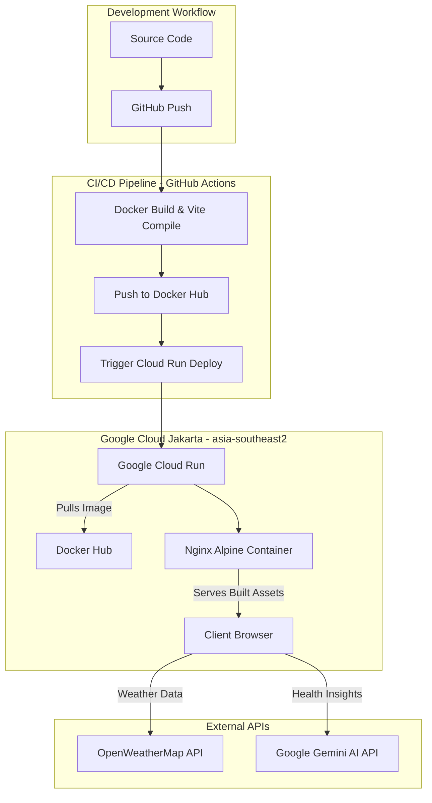

# Luminair - The smart pulse of your environment

Luminair is an immersive, real-time air quality and weather visualization dashboard that fuses raw atmospheric science with interactive generative art. It provides users with a comprehensive, multi-sensory "vibe" of their local environment by blending precise atmospheric metrics, weather forecasts, and Google Gemini AI health recommendations tailored to individual demographic profiles.

---

## ✨ Features

- **Real-time Air Quality (AQI):** Detailed breakdown of pollutants (PM2.5, PM10, CO, NO2, O3, SO2) utilizing the OpenWeatherMap Air Pollution API.
- **Dynamic Weather Visuals:** Generative HTML5 background canvas that dynamically changes based on weather conditions (Clear, Clouds, Rain, Storm, Snow) and time of day (Day/Night).
- **Gemini AI Integration:** Personalized medical/health "atmospheric vibe" analysis, safe-window predictions, action checklists, and pollutant context powered by Google's Gemini AI.
- **Interactive Map Interface:** Global geolocated map centering powered by Leaflet.js and Nominatim reverse-geocoding, allowing users to tap anywhere globally to scan atmospheric health.
- **Multi-day & 24h Trends:** Custom canvas-rendered sparklines showcasing pollutant forecasts and daily maximums.
- **Text-to-Speech Narrator:** Fully integrated SpeechSynthesis interface allowing users to hear their AI climate advisor read out reports.
- **Responsive Theme:** A polished, fully modern dark-themed glassmorphism interface styled with Vanilla CSS.

---

## 🛠️ Application Architecture

Luminair utilizes a hybrid architecture: a rich Vanilla JS frontend for maximum performance, and a cloud-native backend deployed to **Jakarta (asia-southeast2)** via automated CI/CD.



### 1. Frontend (The Client-Side Experience)
The user interface is engineered to run entirely in the browser, using optimized client-side technologies to deliver a fluid, "glassmorphic" experience.

* **Core Logic & State:** Implemented using modular **ES6+ Vanilla JavaScript**. By avoiding heavy client-side frameworks, the application loads instantly. State is managed reactively in `state.js`.
* **Styling & UI System:** Built with a custom **Vanilla CSS** design system. It features an elegant glassmorphism theme with smooth backdrop-blur panels and atmospheric colors that shift based on current weather.
* **Procedural Generative Background (`canvas.js`):** An interactive HTML5 Canvas background animation that dynamically matches local weather (Rain, Storm, Snow, Clear, etc.).
* **Text-To-Speech (TTS) Narrator:** Integrates with the **SpeechSynthesis Web API** to vocally read AI clinical safety advice.

### 2. Atmospheric & Air Quality Intelligence
Luminair serves as an intelligent hub that pulls data from multiple external sources and pipes it into an advanced AI model to provide actionable health insights.

* **Air Pollution Tracking (AQI):** Fetches the official Air Quality Index (scale of 1 to 5) alongside exact particulate concentrations (PM2.5, PM10, CO, NO2, O3, SO2) from the OpenWeatherMap API.
* **Forecast & Trend Analysis:** Provides 24-hour and 5-day predictive pollutant levels, visualized through interactive sparklines and trends.
* **Google Gemini (`gemini-3.5-flash`):**
  * Analyzes raw atmospheric data to generate a clinical "Atmospheric Digest".
  * Predicts the **Safe Window** (the best 2-3 hour timeframe) for outdoor activities.
  * Provides a tactical **Action Checklist** (e.g., masking or HEPA filter usage) based on the dominant pollutant.
  * Tailors advice to specific profiles: General, Children, Elderly, Active Outdoors, and Sensitive Groups.

### 3. Infrastructure-as-Code (Terraform)
The entire GCP infrastructure is managed via **Terraform**, ensuring a reproducible environment in the Jakarta region.
* **Cloud Run v2:** Provisioned with specific CPU/RAM limits and auto-scaling.
* **IAM Security:** Automatically configures `allUsers` as `roles/run.invoker` to allow public unauthenticated access.
* **Lifecycle Management:** Configured to ignore container image changes so that Terraform doesn't revert deployments made by GitHub Actions.

### 4. Backend, Containerization, and Deployment
* **Docker Hub:** Replaces internal registries for faster, universal image storage and easier integration with external tools.
* **Multi-Stage Dockerfile:** 
    1. **Build Stage:** Compiles the Vite project.
    2. **Production Stage:** Serves assets via a lightweight **Nginx Alpine** image.
* **Runtime Secret Injection:** Uses a custom `sed` startup pattern to inject `VITE_API_KEY` and `VITE_GEMINI_API_KEY` into the static JavaScript files at container launch, allowing the same image to work with different keys.

---

## 📂 Project Structure

```text
luminair/
├── .github/workflows/deploy.yml # CI/CD: Builds Docker image -> Docker Hub -> Cloud Run
├── public/assets/               # Static icons, backgrounds, and fonts
├── src/js/                      # Vanilla JS Modules (api, ui, canvas, state)
├── terraform/                   # Infrastructure-as-Code (Jakarta region)
│   ├── main.tf                  # Cloud Run & Public Access IAM configuration
│   ├── variables.tf             # Default region set to asia-southeast2
│   └── terraform.tfvars.example # Template for GCP & API secrets
├── Dockerfile                   # Multi-stage build (Node -> Nginx)
├── sa-creation.sh               # Utility to create & authorize GCP Service Accounts
├── nginx.conf                   # Production Nginx configuration
└── index.html                   # Main entry point
```

---

## 🚀 Getting Started

### Local Development
1. **Clone & Install:**
   ```bash
   git clone https://github.com/ahmadluay9/airai-vibecoding.git
   npm install
   ```

2. **Environment:** Copy `.env.example` to `.env` and add your [OpenWeatherMap](https://openweathermap.org/api) and [Gemini AI](https://aistudio.google.com/) keys.
3. **Run:** `npm run dev`

## 📜 License
This project is licensed under the ISC License.
